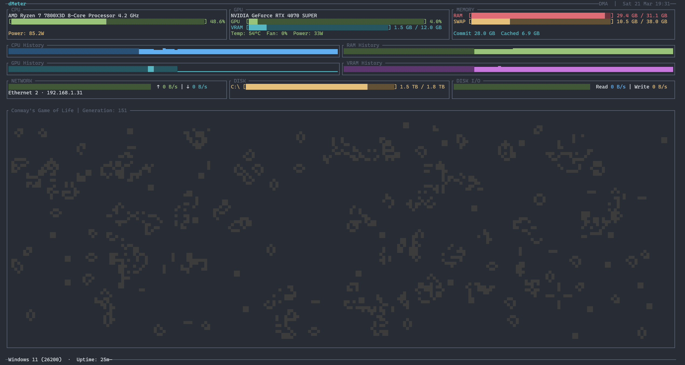

# dMeter

A fast, beautiful terminal system monitor built with Rust and Ratatui, featuring **Conway's Game of Life** as the centerpiece.



## Features

### Conway's Game of Life <3

### System Monitoring

- **CPU**: Real-time usage with temperature, fan speed, and power monitoring
- **Memory**: RAM usage with progress bars and extended memory tracking (Windows)
- **GPU**: NVIDIA GPU monitoring with VRAM tracking and history graphs
- **Disk**: Multi-disk usage for all mounted volumes with responsive bars
- **Network**: Real-time network I/O statistics with history sparklines
- **Disk I/O**: Read/write speeds monitoring with visual graphs

### Visualization

- **History Graphs**: CPU, RAM, GPU, VRAM, Network, and Disk I/O sparklines
- **Game of Life**: The star feature - mesmerizing cellular automaton with half-block rendering for 2x vertical resolution
- **Process Viewer**: Toggle to view running processes sorted by resource usage (CPU + Memory) in dual-column layout
- **Color-coded Metrics**: Intuitive color scheme for quick status assessment
- **Dynamic Layout**: Automatically adapts UI when no GPU is detected - widgets expand to fill freed space
- **Responsive Design**: Adapts to terminal size with proper spacing

## Installation

### Windows (winget)

```powershell
winget install dMeter
```

### From Source

```bash
cargo install --path .
```

This builds and installs the binary to your Cargo bin directory (e.g., `~/.cargo/bin/` on Linux/macOS or `%USERPROFILE%\.cargo\bin\` on Windows), making `dmeter` available globally in your PATH.

### Prerequisites

- Rust toolchain (1.70+)
- For GPU monitoring:
  - **Windows**: NVIDIA drivers with NVML support
  - **Linux**: nvidia-smi command (NVIDIA drivers)
- For Windows memory metrics: WMI access (standard on Windows)

## Usage

```bash
dmeter                    # Run with defaults (2-second refresh)
dmeter --interval 5       # Custom refresh interval (seconds)
```

### Controls

- `q` or `Ctrl+C` - Quit
- `r` - Force refresh
- `g` - Restart Game of Life
- `Space` - Toggle between Game of Life and Process Viewer

## Configuration

Config file location: `~/.config/dmeter/config.toml` (Linux/macOS) or `%APPDATA%\dmeter\config.toml` (Windows)

```toml
interval = 2        # Refresh interval in seconds (default: 2)
```

### Command-Line Options

```bash
dmeter --interval 5  # Set refresh interval to 5 seconds
dmeter -i 3          # Short form
```

## Performance

- **Low CPU overhead**: Targeted `sysinfo` refresh calls instead of `refresh_all()`
- **Memory efficient**: Minimal memory footprint (~10-20 MB)
- **Background processing**: Extended memory metrics collected in a background thread (Windows)
- **Temperature caching**: CPU temperature subprocess called at most every 10 seconds (not every tick)
- **Fast disk I/O**: Disk I/O sampled with minimal blocking (~50ms typeperf call on Windows)
- **IP caching**: Local IP address resolved once and cached for the session
- **Process gating**: Process list only collected when the process viewer is visible
- **Frame limiting**: Rendering capped at 20 FPS to reduce CPU usage
- **Game of Life**: Uses a flat `Vec<bool>` grid for O(1) cell access (no hash overhead)

## Technical Details

### Windows-Specific Features

- **Commit Memory**: Total virtual memory committed by the OS
- **Cached Memory**: Standby/cached RAM that can be freed if needed
- **WMI Integration**: Fast WMIC queries with PowerShell fallback
- **NVML Support**: Direct GPU monitoring via NVIDIA Management Library

### Cross-Platform Support

- **Linux**: sysfs, /proc, nvidia-smi integration
- **Windows**: WMI, Performance Counters, NVML
- **Adaptive UI**: Platform-aware color schemes and layouts

## License

MIT
